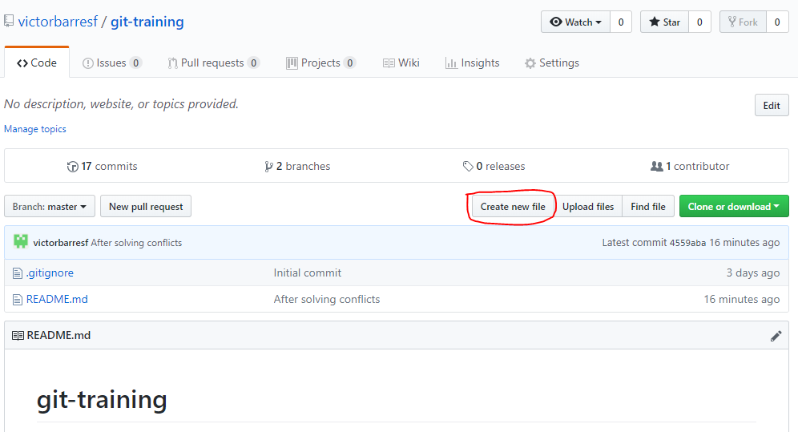
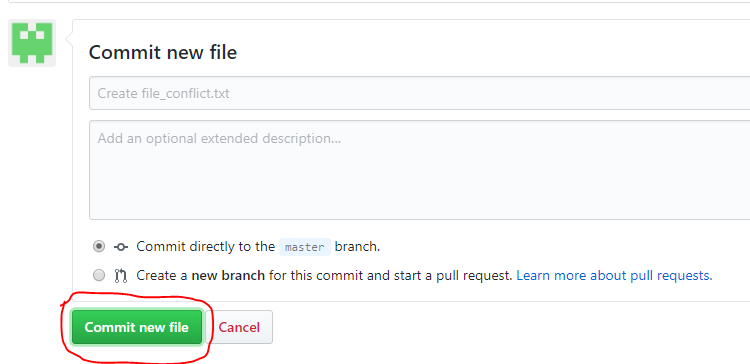

## Merge with conflicts II

 1. Switch to **master**  

    <pre>
    <b>$ git checkout master</b>
    Switched to branch 'master'
    Your branch is up to date with 'origin/master'.
    </pre>
    
 2. Create & commit to **master file_conflict.txt** from **GitHub** web interface.  

    
    

 3. Create & commit to **master file_conflict.txt** from **eclipse**. (here shown how to do it with command line)  
  
     <pre>
        <b>$ vi file_conflict.txt</b>
        <b>$ git add .</b>
        <b>$ git commit -m "File with conflicts from cmd line"</b>
    </pre>

 4. Fetch **master** branch and see the bifurcation in the history view.  
 
    <pre>
    <b>$ git fetch</b>
    <b>$ git log --all</b>
    <b>$ git log --pretty=format:"%h %s" --graph --all</b>
    *8755993 File with conflicts from cmd line
    | * 0af719f Create file_conflict.txt 
    |/
    ...
    </pre>
    
 5. Merge **origin/master** onto **master**

    <pre>
    <b>$ git merge origin master</b>
    Auto-merging file_conflict.txt
    CONFLICT (add/add): Merge conflict in file_conflict.txt
    Automatic merge failed; fix conflicts and then commit the result.
    </pre>

 6. Resolve the conflicts and commit  

    <pre>
    <b>$ vi file_conflict.txt</b>
    <b>$ git add .</b>
    <b>$ git commit -m "Solved conflicts in file_conflict.txt"</b>
    [master d244985] Solved conflicts in file_conflict.txt
    <b>$ git merge origin master</b>
    Already up to date.
    </pre>  
    
    #### Rebase sample
    
    <pre>
    <b>$ git checkout master</b>
    Already on 'master'
    Your branch is up to date with 'origin/master'.
    <b>$ vi README.md</b>
    <b>$ git add .</b>
    <b>$ git commit -m "Check rebase"</b>
    [master 9fc275a] Check rebase
    1 file changed, 1 insertion(+), 1 deletion(-)
    <b>$ git log </b>    (write down the id of the last commit)
    commit 9fc275add8450e652fe38087bc4d431cce510b4e (HEAD -> master)
    Author: VRBS <victor.barres@gft.com>
    Date:   Tue Nov 13 12:29:21 2018 +0100
    Check rebase
    ....
    <b>$ git checkout features/featureGFT</b>
    Switched to branch 'features/featureGFT'
    <b>$ vi other_file.txt</b>
    <b>$ git add .</b>
    <b>$ git commit -m "Created other file to check rebase"</b>
    [features/featureGFT 6750626] Created other file to check rebase
    1 file changed, 2 insertions(+)
    create mode 100644 other_file.txt
    <b>$ git log  </b>	(write down the id of the last commit)
    commit 67506260ab048ebc48a2392eb2491b8ae509ef7a (HEAD -> features/featureGFT)
    Author: VRBS <victor.barres@gft.com>
    Date:   Tue Nov 13 12:33:46 2018 +0100
    Created other file to check rebase
    <b>$ git rebase master </b>
    <b>$ git log </b>     (review commitId)
    <b>$ git checkout master </b>
    <b>$ git merge features/featureGFT </b>
    </pre>
    
## License
Copyright (C) 2017 GFT. All rights reserved.

## Author Information
* Agile & Devops Practice Iberia. GFTIberia.PSU_Technology@gft.com
