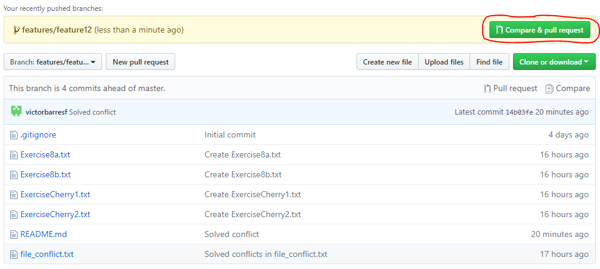
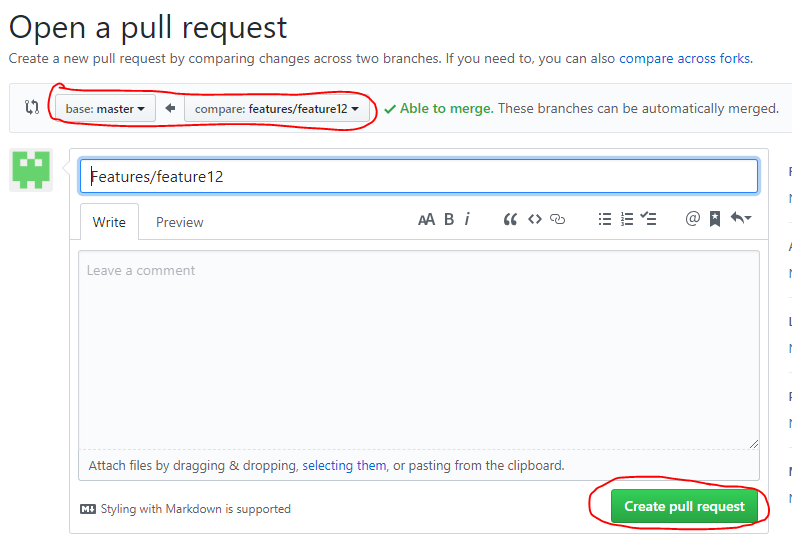
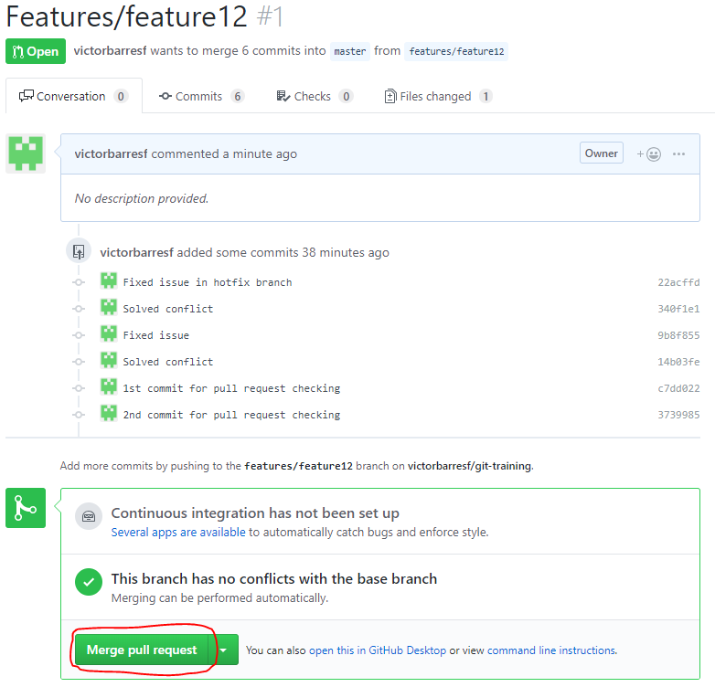

## Pull request I (no conflicts)

 1. Create the branch **features/feature12** from master  

    <pre>
    <b>$ git checkout -b features/feature12</b>
    Switched to a new branch 'features/feature12'
    <b>$ git push -u origin features/feature12</b>
    Enumerating objects: 16, done.
    Counting objects: 100% (16/16), done.
    Delta compression using up to 4 threads
    Compressing objects: 100% (12/12), done.
    Writing objects: 100% (12/12), 1.11 KiB | 227.00 KiB/s, done.
    Total 12 (delta 9), reused 0 (delta 0)
    remote: Resolving deltas: 100% (9/9), completed with 2 local objects.
    remote:
    remote: Create a pull request for 'features/feature12' on GitHub by visiting:
    remote:      https://github.com/victorbarresf/git-training/pull/new/features/feature12
    remote:
    To https://github.com/victorbarresf/git-training.git
    *[new branch]      features/feature12 -> features/feature12
    Branch 'features/feature12' set up to track remote branch 'features/feature12' from 'origin'.
    </pre>  
    
 2. Commit and push 2 changes  

    <pre>
    <b>$ vi README.md</b>
    <b>$ git add .</b>
    <b>$ git commit -m "1st commit for pull request checking"</b>
    [features/feature12 c7dd022] 1st commit for pull request checking
    1 file changed, 3 insertions(+), 1 deletion(-)
    <b>$ vi README.md</b>
    <b>$ git add .</b>
    <b>$ git commit -m "2nd commit for pull request checking"</b>
    [features/feature12 3739985] 2nd commit for pull request checking
    1 file changed, 2 insertions(+), 1 deletion(-)
    <b>$ git push -u origin features/feature12 </b>
    Enumerating objects: 8, done.
    Counting objects: 100% (8/8), done.
    Delta compression using up to 4 threads
    Compressing objects: 100% (6/6), done.
    Writing objects: 100% (6/6), 624 bytes | 156.00 KiB/s, done.
    Total 6 (delta 4), reused 0 (delta 0)
    remote: Resolving deltas: 100% (4/4), completed with 2 local objects.
    To https://github.com/victorbarresf/git-training.git
    14b03fe..3739985  features/feature12 -> features/feature12
    Branch 'features/feature12' set up to track remote branch 'features/feature12' from 'origin'.
    </pre>
    
 3. Go to GitHub and create a pull request to merge **features/feature12** changes onto master  

    Create Pull Request in GitHub:
    
      
        
    
 4. Approve the Pull Request (PR)  

    Approve Pull Request in GitHub:
    
        
 
 5. Fetch

    <pre>
    <b>$ git checkout master</b>
    <b>$ git fetch origin</b>
    remote: Enumerating objects: 1, done.
    remote: Counting objects: 100% (1/1), done.
    remote: Total 1 (delta 0), reused 0 (delta 0), pack-reused 0
    Unpacking objects: 100% (1/1), done.
    From https://github.com/victorbarresf/git-training
    6db0994..e049130  master     -> origin/master
    <b>$ git merge</b>
    </pre>  

## License
Copyright (C) 2017 GFT. All rights reserved.

## Author Information
* Agile & Devops Practice Iberia. GFTIberia.PSU_Technology@gft.com
