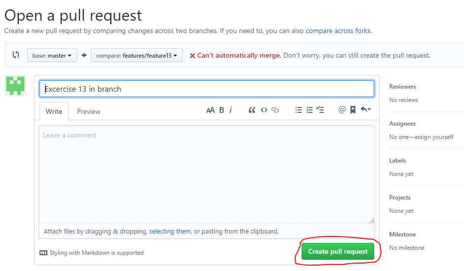
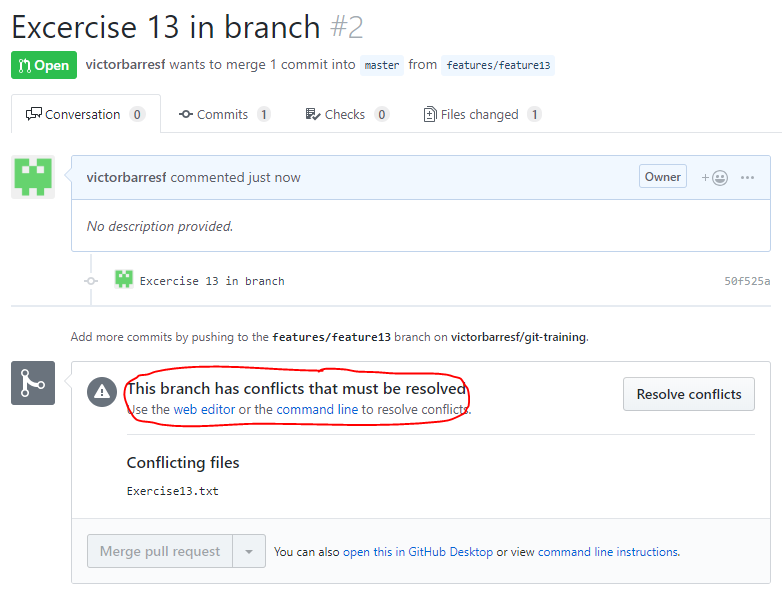
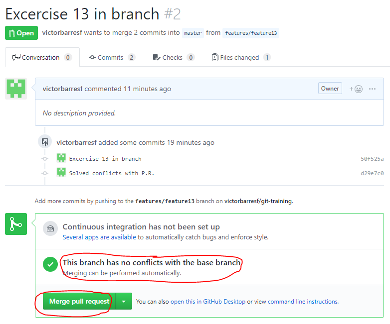

## Pull request II (conflicts)

 1. Create the branch **features/feature13** from master.  

    <pre>
    <b>$ git checkout -b features/feature13 master</b>
    Switched to a new branch 'features/feature13'
    <b>$ git push -u origin features/feature13</b>
    Total 0 (delta 0), reused 0 (delta 0)
    remote:
    remote: Create a pull request for 'features/feature13' on GitHub by visiting:
    remote:      https://github.com/victorbarresf/git-training/pull/new/features/feature13
    remote:
    To https://github.com/victorbarresf/git-training.git
    *[new branch]      features/feature13 -> features/feature13
    Branch 'features/feature13' set up to track remote branch 'features/feature13' from 'origin'.
    </pre>  
    
 2. Create file **Exercise13.txt** with some text.  

    <pre>
    <b>$ vi Exercise13.txt</b>
    <b>$ git add .</b>
    <b>$ git commit -m "Excercise 13 in branch"</b>
    [features/feature13 50f525a] Excercise 13 in branch
    1 file changed, 1 insertion(+)
    create mode 100644 Exercise13.txt
    <b>$ git push -u origin features/feature13</b>
    Enumerating objects: 4, done.
    Counting objects: 100% (4/4), done.
    Delta compression using up to 4 threads
    Compressing objects: 100% (2/2), done.
    Writing objects: 100% (3/3), 305 bytes | 76.00 KiB/s, done.
    Total 3 (delta 1), reused 0 (delta 0)
    remote: Resolving deltas: 100% (1/1), completed with 1 local object.
    To https://github.com/victorbarresf/git-training.git
    e049130..50f525a  features/feature13 -> features/feature13
    Branch 'features/feature13' set up to track remote branch 'features/feature13' from 'origin'.
    </pre>  
    
 3. Create file **Exercise13.txt** with some text from **GitHub** web interface (master branch)  

    Create file Exercise13.txt in github in master  
        
 4. Go to GitHub and create a pull request to merge **features/feature13** changes onto **master**  
  
      
      

 
 5. Fetch & merge **master** onto **features/feature13**    
   
    <pre>
        <b>$ git checkout master</b>
        Switched to branch 'master'
        Your branch is up to date with 'origin/master'.
        <b>$ git fetch</b>
        remote: Enumerating objects: 4, done.
        remote: Counting objects: 100% (4/4), done.
        remote: Compressing objects: 100% (2/2), done.
        remote: Total 3 (delta 1), reused 0 (delta 0), pack-reused 0
        Unpacking objects: 100% (3/3), done.
        From https://github.com/victorbarresf/git-training
        e049130..b08706d  master     -> origin/master
        <b>$ git merge origin/master</b>
        Updating e049130..b08706d
        Fast-forward
        Exercise13.txt | 1 +
        1 file changed, 1 insertion(+)
        create mode 100644 Exercise13.txt
        <b>$ git checkout features/feature13</b>
        Switched to branch 'features/feature13'
        Your branch is up to date with 'origin/features/feature13'.
        <b>$ git merge master</b>
        Auto-merging Exercise13.txt
        CONFLICT (add/add): Merge conflict in Exercise13.txt
        Automatic merge failed; fix conflicts and then commit the result.
    </pre>  

   6. Resolve conflicts  

        <pre>
        <b>$ vi Exercise13.txt</b>
        </pre>  
        
   7. Commit & push (The PR will be update automatically)  
 
        <pre>
        <b>$ git add .</b>
        <b>$ git commit -m "Solved conflicts with P.R."</b>
        [features/feature13 d29e7c0] Solved conflicts with P.R.
        <b>$ git push -u origin features/feature13</b>
        Enumerating objects: 1, done.
        Counting objects: 100% (1/1), done.
        Writing objects: 100% (1/1), 225 bytes | 112.00 KiB/s, done.
        Total 1 (delta 0), reused 0 (delta 0)
        To https://github.com/victorbarresf/git-training.git
        50f525a..d29e7c0  features/feature13 -> features/feature13
        Branch 'features/feature13' set up to track remote branch 'features/feature13' from 'origin'.
        </pre>  

 7. Approve the PR  
 

     

## License
Copyright (C) 2017 GFT. All rights reserved.

## Author Information
* Agile & Devops Practice Iberia. GFTIberia.PSU_Technology@gft.com
